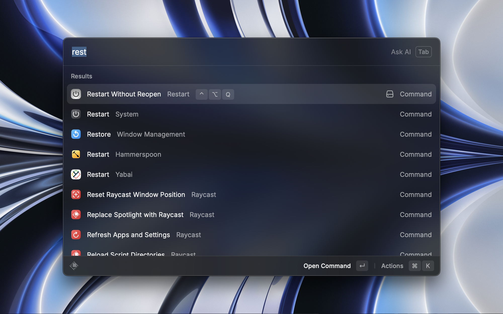

  
  <h1 align="center">Restart Without Reopen</h1>

Restart, but different Raycast built-in command, this one will not reopen windows after restart.
Which provide a cleaner, freshed start.
Run by AppleScript.

